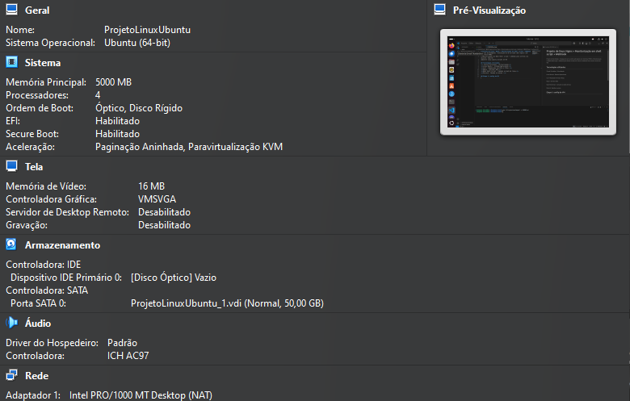
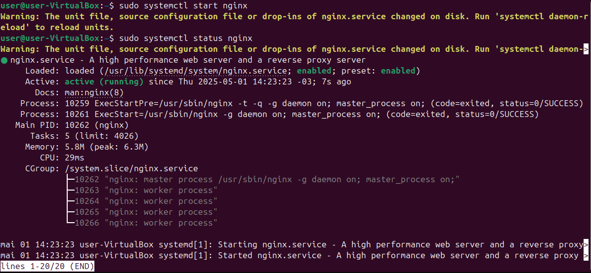
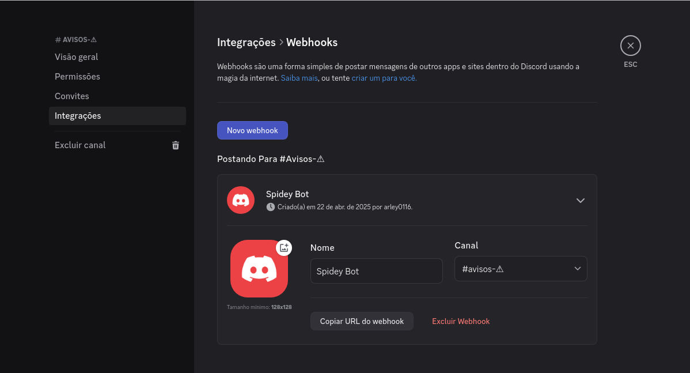
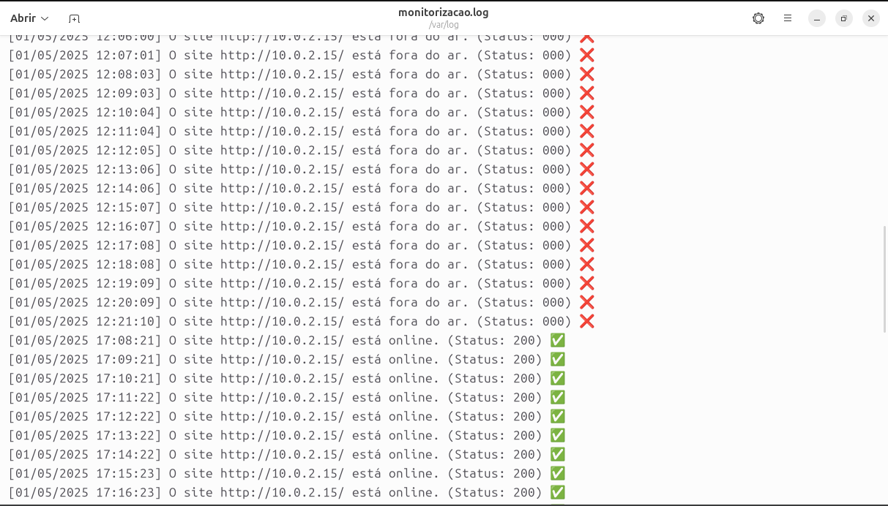
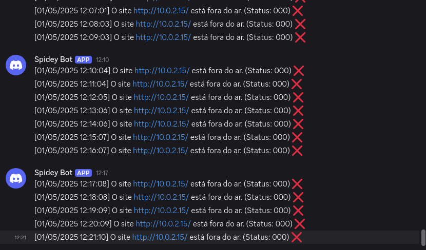

# Projeto de linux: Nginx + Monitorização em shell script + Webhook
Projeto de DevOpsSec. instalação de um servidor web (nginx) com interface HTML5
e Monitorização via Bash Shell script + webhook para alertas via discord. Tudo em
ambiente linux ubuntu através de VM.

## Tecnologias Utilizadas.
Oracle Virtualbox - Virtualização.

Linux Ubuntu - Sistema Operacional

Curl - Requisição via http e https.

Nginx - Servidor Web.

Bash Shell Script - Comando no bash do linux.

Discord - Recebe os avisos.

## Etapa 1.0: Configuração da VM



## Etapa 1.1: Instalação e Inicialização Ngnix
Vá até o terminal e digite como root ```sudo apt install nginx``` .

Após ative o nginx com ```sudo systemctl start nginx```.

Com ```sudo systemctl status nginx``` veja se está rodando.

Em caso de erro de porta ultilize ```sudo ufw enable``` e em seguida ```sudo ufw allow 80/tcp``` para liberar a porta HTTP.

Irá visualizar assim:



## Etapa 1.2: Criação do WebHook (Discord)

Primeiro você terá que criar um ```Canal``` no discord, após a criação do canal vamos na ```⚙️``` ao lado do nome do canal:
[config-canal](img/ConfigCanal.png). em seguida vá em ```Integrações - Novo webhook```.



## Etapa 2.0: Script de Monitorização.

Antes de começar escrever os comandos instale o ```curl``` para as requisições via http no nginx funcionar. Para instalar digite o seguinte ```sudo apt install curl -y```. Após isso vamos para o código: 
```
#!/bin/bash

SITE="http://10.0.2.15/"

WEBHOOK="https://discordapp.com/api/webhooks/..."

LOGDIR="/var/log"
LOGFILE="$LOGDIR/monitorizacao.log"

mkdir -p "$LOGDIR"
sudo touch "$LOGFILE"

while :; do

STATUS=$( curl -s -o /dev/null -w "%{http_code}" http://10.0.2.15/ )

DATA=$(date "+%d/%m/%Y %H:%M:%S")

if [[ "$STATUS" -eq 200 ]]; then
    
    MENSAGEM="[$DATA] O site $SITE está online. (Status: $STATUS) ✅"
    curl -H "Content-Type: application/json"\
       -d "{\"content\": \"$MENSAGEM\"}" \
       $WEBHOOK
    
    else
    MENSAGEM="[$DATA] O site $SITE está fora do ar. (Status: $STATUS) ❌"
     curl -H "Content-Type: application/json"\
        -d "{\"content\": \"$MENSAGEM\"}" \
        $WEBHOOK

fi
    echo "$MENSAGEM" >> "$LOGFILE"
    
    sleep 60 
done
```
```linha 1```- declaramos a shebang ```#!/bin/bash``` para que o script seja interpretado pelo bash. Da ```linha 3 a 5``` declaramos as variáveis do link ```webhook``` e da ```URL``` do site que vai ser monitorado.

```Linha 7 a 11```- Cria o arquivo um log (caso não exista), que irá servir como documentação de monitoramente.

```Linha 13 a 17```- Inicia com um loop infinito ```while :; do```. Após isso a variavel ```STATUS``` vai fazer uma requisição ao site e armazena o status HTTP. variavel ```DATE``` armazena data e hora local.

```Linha 19 a 21```- A condifcional ```if``` verifica se a variavel ```$STATUS``` retorna ```200```. A variavel ```MENSAGEM``` define qual mensagem será enviada caso o retorno for ```200```.

```Linha 21 a 24```- Enviamnos uma notificação via ```webhook``` inicia com ```curl``` para fazer a requisição HTTP ```-H "Content-Type: application/json"\``` para que a requisição vá em formato ```JSON```. Agora o codigo ```-d "{\"content\": \"$MENSAGEM\"}" \``` envia uma mensagem em ```JSON``` para o destino ```$WEBHOOK``` declarado no inicio do código.

```Linha 26 a 30```- No da requisição não retornar ```200``` entra no ```else``` informando a inatividade do serviço.

```Linha 32 a 36```- Começa com ```fi``` para finalizar a condicional, na linha abaixo ```echo``` que vai escrever a mensagem no arquivo ```.log```. ```sleep 60``` informa que o loop ira recomeçar a cada 60 segundos. Para finalizar o loop ```done```

## 🌟Bônus - Iniciar o script ao ligar a máquina 🌟

Crie um arquivo como root ```sudo vim /etc/systemd/system/aquivo.service``` dentro dele coloque:
```
[Unit]
Description=Monitoramento de site com webhook
After=network.target

[Service]
ExecStart=/home/user/Documentos/teste/shell.sh #caminho do .sh
Restart=always
User=root #mude o root se necessário
Environment=PATH=/usr/bin:/bin
WorkingDirectory=/home/user #diretorio do úsuario

[Install]
WantedBy=multi-user.target 
```
Após o seu arquivo ```shell``` terá que ter permissão de excução ```sudo chmod +x camiho/arquivo.shell```. Atualize o systemd com ```sudo systemctl daemon-reload``` e habilite e inicia o serviço com ```sudo systemctl enable arquivo.service``` e  ```sudo systemctl start arquivo.service```. depois desses passos faça a verificação ```sudo systemctl status arquivo.service```. 

## Conclusão

Ao seguir todos os passo iram chegar no resultado. Se a requisição retonar ```200``` irá gerar uma mensagem de serviço online ao mesmo tempo irá informar em uma arquivo ```.log``` o resultado desejado criando um historico de monitorização, caso o mesmo não retorne ```200``` envia uma nova mensagem informando a queda do serviço no arquivo ```.log``` e via ```webhook``` para o discord.

**Resultados: .log**


**Resultados: Discord**

